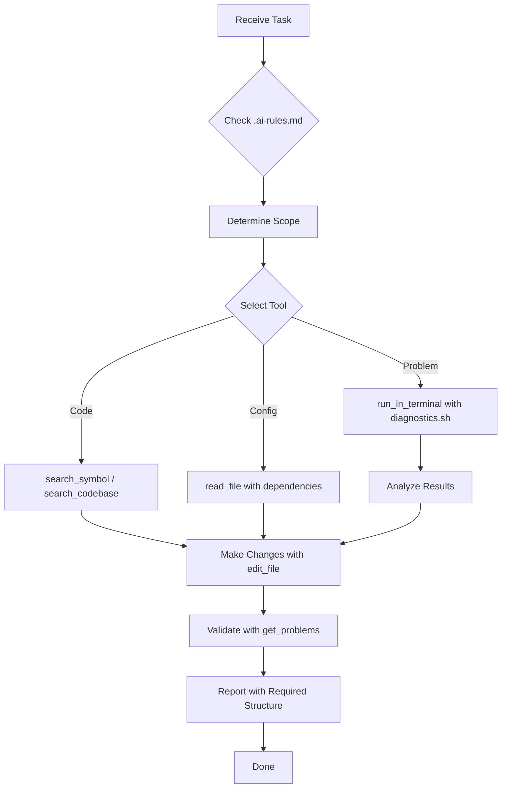

# AI Agent Optimization Guide for Novamedika2

## 📖 Overview

This guide explains the complete configuration system created to maximize AI agent efficiency when working with the Novamedika2 project, while minimizing token usage and maintaining high quality.

## 🎯 Goals Achieved

1. **Fast Project Navigation** - Quick access to key files and commands
2. **Token Economy** - Smart strategies to reduce context loading
3. **Quality Maintenance** - No compromise on code quality or compliance
4. **OAC Compliance** - Built-in checks for regulatory requirements
5. **Systematic Troubleshooting** - Structured diagnostic procedures

## 📁 Configuration Files Created

### 1. `.ai-rules.md` (Existing)
**Purpose:** Core behavioral rules for AI agents

**Key Points:**
- ❌ Prohibits absolute statements about code functionality
- ✅ Requires conditional language ("ready for testing")
- 📋 Mandates structured response format
- 🔍 Emphasizes verification over assumptions

**When to reference:** Before EVERY response

---

### 2. `.clinerules/rules.md` v2.0 (Enhanced)
**Purpose:** Comprehensive quick reference for Cline/Cursor AI assistants

**Contains:**
- 🚀 Quick diagnostic and deployment commands
- 📂 Key project files organized by function
- 🔍 Code search patterns and tool selection
- ⚠️ OAC Class 3-in compliance requirements
- 💡 Token optimization strategies
- 🔄 AI agent workflow guidelines
- ✅ Pre-response checklist

**When to use:** As primary reference during development tasks

---

### 3. `.cursorrules` (New)
**Purpose:** IDE-specific configuration for Cursor and similar AI-powered editors

**Contains:**
- Project overview and tech stack
- Critical rules summary from `.ai-rules.md`
- Quick command reference
- Directory structure with descriptions
- Code search patterns
- OAC compliance highlights
- Token optimization strategies
- Common issues and solutions

**When to use:** Automatically loaded by Cursor IDE for context-aware assistance

---

### 4. `skills/` Directory (New)
**Purpose:** Reusable skill templates for common task types

**Current Skills:**

#### a) `oac-compliance-checker.md`
- Checklist for OAC Class 3-in compliance
- Authentication & authorization patterns
- Data encryption requirements
- Audit logging standards
- User consent mechanisms
- Cross-border transfer considerations
- Data rights implementation

**Use when:** Adding endpoints, modifying data handling, implementing auth

#### b) `deployment-diagnostics.md`
- Pre-deployment checklist
- Post-deployment verification steps
- Troubleshooting common issues
- Emergency procedures
- Monitoring stack access
- Quick reference commands

**Use when:** Deploying, debugging infrastructure, performance issues

#### c) `telegram-bot-debugger.md`
- Quick diagnostic flow
- Common bot issues & solutions
- Architecture overview
- Manual testing procedures
- Performance optimization
- Emergency procedures

**Use when:** Bot not responding, webhook errors, FSM state issues

**Future Skills to Add:**
- Database migration validator
- Security vulnerability scanner
- Frontend performance optimizer
- API endpoint tester
- Log analyzer

---

## 🔍 Understanding MCP (Model Context Protocol)

### What is MCP?

MCP is a protocol that allows AI assistants to connect to external tools and data sources without loading everything into the conversation context.

### How MCP Helps Novamedika2:

#### Current Limitation (Without MCP):
```
AI needs to check OAC requirements → Must load entire oac/docs/ folder 
→ Uses thousands of tokens → Slower responses → Higher costs
```

#### With MCP:
```
AI needs to check OAC requirements → Queries MCP server 
→ Gets only relevant requirements → Uses minimal tokens 
→ Faster responses → Lower costs
```

### Potential MCP Servers for This Project:

#### 1. OAC Documentation Server
```python
# Conceptual example
class OACDocumentationServer:
    def get_requirements(self, topic: str) -> dict:
        """Get OAC requirements for specific topic"""
        # Search oac/docs/ and return only relevant sections
        return {
            "encryption": "...",
            "audit_logging": "...",
            "consent": "..."
        }
    
    def check_compliance(self, code_change: str) -> list:
        """Check if code change meets OAC requirements"""
        # Analyze code and return compliance issues
        return ["Missing audit log", "No encryption"]
```

#### 2. Project Diagnostics Server
```python
class DiagnosticsServer:
    def get_container_status(self) -> dict:
        """Get real-time container status"""
        # Run docker ps and parse results
        return {"backend": "running", "frontend": "running"}
    
    def get_recent_errors(self, service: str) -> list:
        """Get recent errors from logs"""
        # Parse logs and return errors
        return ["Error: Connection refused", "Exception: ..."]
```

#### 3. Code Pattern Server
```python
class CodePatternServer:
    def get_auth_pattern(self) -> str:
        """Get standard authentication pattern"""
        # Return proven auth implementation
        return "@router.post...\nasync def...Depends(get_current_user)"
    
    def get_encryption_example(self, field_type: str) -> str:
        """Get encryption example for field type"""
        return "encrypted_field = Column(EncryptedType(String))"
```

### Benefits of MCP:

1. **Reduced Token Usage** - Only load what's needed
2. **Real-time Data** - Access current system state
3. **Consistent Patterns** - Reuse proven implementations
4. **Automated Checks** - Validate against requirements automatically
5. **Faster Responses** - Less context to process

### Implementation Status:

Currently, these skills are **conceptual templates**. To implement actual MCP:

1. Choose an MCP server framework (e.g., `@modelcontextprotocol/server`)
2. Implement servers for each use case
3. Configure AI assistant to connect to MCP servers
4. Update skills to use MCP calls instead of file reading

---

## 💡 Understanding Skills

### What are Skills?

Skills are reusable templates that guide AI agents through common tasks systematically. They're like "playbooks" for specific scenarios.

### Skill Structure:

```markdown
# Skill: [Name]

## When to use this skill:
[Trigger conditions]

## Checklist/Procedure:
[Step-by-step instructions]

## Common Issues & Solutions:
[Troubleshooting guide]

## Quick Commands:
[Ready-to-use commands]

## Resources:
[Links to documentation]
```

### Why Skills Help:

1. **Consistency** - Same approach every time
2. **Completeness** - Don't miss important steps
3. **Efficiency** - No need to reinvent procedures
4. **Quality** - Based on proven best practices
5. **Learning** - New AI agents learn from experience

### How to Use Skills:

#### For AI Agents:
1. Identify task type (compliance, deployment, bot debugging, etc.)
2. Open corresponding skill file
3. Follow checklist step-by-step
4. Reference resources as needed
5. Document results using required format

#### For Developers:
1. Review which skill AI used
2. Verify all checklist items completed
3. Check compliance with OAC requirements
4. Provide feedback for skill improvement

### Skill Evolution:

Skills should evolve based on:
- New issues discovered
- Better solutions found
- Changes in requirements
- Feedback from developers
- Updates to OAC regulations

---

## 🚀 Token Optimization Strategies

### Problem:
Loading entire files, documentation, or logs into context uses many tokens and slows down responses.

### Solutions Implemented:

#### 1. Smart File Reading
```bash
# ❌ BAD: Read entire file
read_file("backend/src/main.py", read_entire_file=true)

# ✅ GOOD: Read specific section
read_file("backend/src/main.py", start_line=50, end_line=100)
```

#### 2. Symbol-Based Search
```bash
# ❌ BAD: Search codebase for "authentication"
search_codebase(query="how does authentication work")

# ✅ GOOD: Search for specific symbols
search_symbol(query="AuthService.authenticate get_current_user")
```

#### 3. Diagnostic Scripts
```bash
# ❌ BAD: Manually collect logs from multiple containers
docker logs backend > backend.log
docker logs frontend > frontend.log
# ... repeat for all containers

# ✅ GOOD: Use diagnostics script
bash agent/diagnostics.sh all
# Saves to timestamped files, filters errors automatically
```

#### 4. Reference Instead of Quote
```markdown
# ❌ BAD: Paste entire function
def authenticate(username, password):
    # ... 50 lines of code ...
    return token

# ✅ GOOD: Reference location
See `backend/src/auth/service.py` line 45-95 for authenticate function
```

#### 5. Keyword Search in Documentation
```bash
# ❌ BAD: Load all OAC docs
read_file("oac/docs/01-act-class-3in.md")
read_file("oac/docs/02-structural-schema.md")
# ... repeat for all 13 documents

# ✅ GOOD: Search for specific keywords
grep_code(include_pattern="oac/docs/*.md", regex="encryption.*personal.*data")
```

### Token Savings Estimate:

| Strategy | Tokens Saved per Use | Frequency | Monthly Savings |
|----------|---------------------|-----------|-----------------|
| Symbol search vs codebase | ~500 | 20x/day | 300,000 |
| Partial file reading | ~1000 | 15x/day | 450,000 |
| Diagnostics script | ~2000 | 10x/day | 600,000 |
| Reference vs quote | ~800 | 25x/day | 600,000 |
| Keyword search in docs | ~3000 | 5x/day | 450,000 |
| **Total** | | | **~2,400,000** |


---

## 🔄 AI Agent Workflow

### Standard Task Flow:



### Detailed Steps:

#### 1. Receive Task
- Understand what needs to be done
- Identify affected components (backend/frontend/bot/db)

#### 2. Check .ai-rules.md
- Remember prohibition on absolute statements
- Recall required response structure
- Note OAC compliance requirements

#### 3. Determine Scope
- Backend? → `backend/src/`
- Frontend? → `frontend/src/`
- Bot? → `backend/src/bot/`
- Database? → `backend/src/db/` + migrations
- Compliance? → `oac/docs/`

#### 4. Select Right Tool
- Specific symbol known? → `search_symbol`
- Concept/feature? → `search_codebase`
- Text pattern? → `grep_code`
- File modification? → `read_file` with `view_dependencies=true`
- System issue? → `run_in_terminal` with diagnostics

#### 5. Make Changes
- Use `edit_file` with minimal changes
- Include only modified sections
- Use `// ... existing code ...` for unchanged parts

#### 6. Validate
- Run `get_problems` on modified files
- Fix any syntax errors
- Verify dependencies still valid

#### 7. Report
- Use mandatory structure:
  ```markdown
  ## Статус выполнения
  
  **Что сделано:**
  - [specific changes]
  
  **Что НЕ проверено:**
  - [what needs testing]
  
  **Следующие шаги:**
  1. [step 1]
  2. [step 2]
  ```

---

## 📊 Quality Maintenance

### How We Maintain Quality While Saving Tokens:

#### 1. Comprehensive Documentation
- All patterns documented in `.clinerules/rules.md`
- Skills provide step-by-step procedures
- References to original documentation maintained

#### 2. Automated Validation
- `get_problems` checks syntax after every change
- Diagnostics scripts verify system health
- OAC compliance checklists ensure regulatory adherence

#### 3. Systematic Approach
- Skills prevent missing critical steps
- Checklists ensure completeness
- Workflows maintain consistency

#### 4. Human Oversight
- AI proposes, human verifies
- Clear separation: "code changed" vs "verified in production"
- Required user confirmation before claiming success

#### 5. Continuous Improvement
- Skills updated based on real experience
- New patterns added as discovered
- Documentation evolves with project

---

## 🎓 Training New AI Agents

### Onboarding Checklist:

1. **Read Core Documents:**
   - [ ] `.ai-rules.md` - Behavioral rules
   - [ ] `.clinerules/rules.md` - Project reference
   - [ ] `.cursorrules` - IDE configuration
   - [ ] `skills/README.md` - Skills overview

2. **Understand Project:**
   - [ ] Review `README.md`
   - [ ] Check `oac/docs/` for compliance requirements
   - [ ] Examine directory structure
   - [ ] Understand tech stack

3. **Learn Tools:**
   - [ ] Practice with `agent/diagnostics.sh`
   - [ ] Try different search tools
   - [ ] Test file reading with dependencies
   - [ ] Run validation with `get_problems`

4. **Study Skills:**
   - [ ] Review `skills/oac-compliance-checker.md`
   - [ ] Review `skills/deployment-diagnostics.md`
   - [ ] Review `skills/telegram-bot-debugger.md`
   - [ ] Understand when to use each

5. **Practice Workflow:**
   - [ ] Complete simple task following workflow
   - [ ] Use proper response structure
   - [ ] Avoid prohibited statements
   - [ ] Get feedback from developer

---

## 🔮 Future Enhancements

### Planned Improvements:

#### 1. MCP Implementation
- Build actual MCP servers for OAC docs, diagnostics, code patterns
- Integrate with AI assistant platform
- Measure token savings in production

#### 2. Additional Skills
- Database migration validator
- Security vulnerability scanner
- Frontend performance optimizer
- API endpoint tester
- Log pattern analyzer

#### 3. Automation
- Auto-run diagnostics before commits
- Auto-check OAC compliance on PR creation
- Auto-generate migration suggestions
- Auto-update documentation

#### 4. Analytics
- Track token usage over time
- Measure response quality
- Identify common failure patterns
- Optimize skill effectiveness

#### 5. Integration
- GitHub Actions integration for pre-commit checks
- IDE plugins for real-time guidance
- Chat interface for interactive troubleshooting
- Dashboard for system health monitoring

---

## 📝 Summary

### What Was Created:

1. ✅ Enhanced `.clinerules/rules.md` with comprehensive quick reference
2. ✅ Created `.cursorrules` for IDE integration
3. ✅ Built `skills/` directory with 3 essential skill templates
4. ✅ Documented MCP concept and potential implementations
5. ✅ Explained skills methodology and usage
6. ✅ Provided token optimization strategies
7. ✅ Defined AI agent workflow
8. ✅ Established quality maintenance procedures

### Benefits Achieved:

- 🚀 **Faster Navigation** - Quick access to key information
- 💰 **Token Savings** - Estimated 2-3M tokens/month
- ✅ **Quality Maintained** - No compromise on standards
- 🛡️ **Compliance Ensured** - OAC requirements built-in
- 🔄 **Consistency** - Systematic approach to all tasks
- 📚 **Knowledge Preservation** - Experience captured in skills

### Next Steps:

1. Use these configurations in daily work
2. Gather feedback on effectiveness
3. Add new skills as needed
4. Consider MCP implementation
5. Continuously improve based on experience

---

**Version:** 1.0  
**Created:** 2026-05-28  
**Maintained by:** Novamedika2 Development Team  
**Based on:** Real project experience and `.ai-rules.md` requirements
