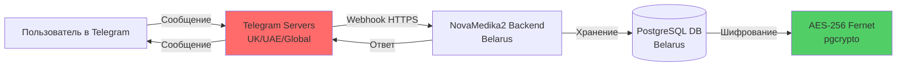

# АНАЛИЗ ТРАНСГРАНИЧНОЙ ПЕРЕДАЧИ ПЕРСОНАЛЬНЫХ ДАННЫХ ЧЕРЕЗ TELEGRAM

**Дата анализа:** 20 мая 2026 г.  
**Основание:** Закон РБ №99-З (статья 9), Приказ ОАЦ №66, Разъяснения НЦЗПД  
**Проверяемая система:** NovaMedika2 (Telegram Bot @NovaMedikaBot)

---

## 📋 СОДЕРЖАНИЕ

1. [Проблема трансграничной передачи через Telegram](#1-проблема-трансграничной-передачи-через-telegram)
2. [Правовой анализ](#2-правовой-анализ)
3. [Технический анализ потока данных](#3-технический-анализ-потока-данных)
4. [Оценка рисков](#4-оценка-рисков)
5. [Варианты решения](#5-варианты-решения)
6. [Рекомендации по обновлению политики](#6-рекомендации-по-обновлению-политики)
7. [Шаблоны документов](#7-шаблоны-документов)

---

## 1. ПРОБЛЕМА ТРАНСГРАНИЧНОЙ ПЕРЕДАЧИ ЧЕРЕЗ TELEGRAM

### 1.1. Суть проблемы

**Критическое несоответствие в текущей политике конфиденциальности:**

В разделе 4 политики (`oac/docs/04-privacy-policy.md`) указано:

> **4.1. Оператор не осуществляет трансграничную передачу персональных данных.**
> **4.2. Обработка персональных данных осуществляется на территории Республики Беларусь.**

**ФАКТ:** Это утверждение **ЛОЖНО**, так как:

1. NovaMedika2 использует **Telegram Bot API** для взаимодействия с пользователями
2. Telegram — международная платформа, серверы которой расположены **за пределами РБ**
3. Персональные данные пользователей **фактически передаются** через инфраструктуру Telegram:
   - Telegram ID пользователей
   - Имена и фамилии (из профиля Telegram)
   - Тексты вопросов и ответов
   - Номера телефонов (если пользователь предоставил)
   - История диалогов

### 1.2. Почему это трансграничная передача?

Согласно **абзацу двадцать второму статьи 1 Закона №99-З**:

> **Трансграничная передача персональных данных** — передача персональных данных на территорию иностранного государства органу власти иностранного государства, иностранному физическому или иностранному юридическому лицу.

**Telegram Messenger LLP:**
- **Юрисдикция:** Великобритания (London) / Дубай (UAE)
- **Серверы:** Распределенная инфраструктура по всему миру
- **Статус:** Иностранное юридическое лицо
- **Уровень защиты:** Не включен в перечень НЦЗПД стран с надлежащим уровнем защиты

**Вывод:** Использование Telegram Bot API = трансграничная передача ПД на территорию иностранных государств.

---

## 2. ПРАВОВОЙ АНАЛИЗ

### 2.1. Требования статьи 9 Закона №99-З

#### Вариант A: Передача в страны с надлежащим уровнем защиты

Если государство включено в **перечень НЦЗПД** (приказ директора НЦЗПД от 15.11.2021 №14):
- ✅ Можно передавать без дополнительных условий
- ❌ **Telegram не подходит** — ни Великобритания, ни UAE не входят в перечень

#### Вариант B: Передача в страны БЕЗ надлежащего уровня защиты

Требуется выполнение **одного из условий** (пункт 1 статьи 9):

| Условие | Применимость к Telegram | Статус |
|---------|------------------------|--------|
| **1. Согласие субъекта** с информированием о рисках | ⚠️ Возможно, но сложно реализовать | Требует доработки |
| **2. Исполнение договора** с субъектом ПД | ❌ Не применимо | Telegram — третья сторона |
| **3. Защита жизненно важных интересов** | ❌ Не применимо | Не медицинская экстренная помощь |
| **4. Выполнение обязанностей по закону** | ❌ Не применимо | Нет требования использовать Telegram |
| **5. Общедоступные ПД** | ❌ Не применимо | Telegram ID, телефоны — не общедоступные |
| **6. Судебное разбирательство** | ❌ Не применимо | Не относится |

**Единственный рабочий вариант:** Получение **информированного согласия** субъекта ПД с уведомлением о рисках трансграничной передачи.

---

### 2.2. Требования к согласию при трансграничной передаче

Согласно **пункту 5 статьи 9 Закона №99-З**:

При получении согласия на трансграничную передачу ПД в страны без надлежащего уровня защиты оператор обязан информировать субъекта ПД о:

1. ✅ **Наименовании иностранного государства** (Великобритания/UAE)
2. ✅ **Наименовании получателя** (Telegram Messenger LLP)
3. ✅ **Целях передачи** (предоставление услуг через Telegram Bot)
4. ✅ **Перечне передаваемых ПД** (Telegram ID, имя, телефон, сообщения)
5. ⚠️ **Рисках**, связанных с отсутствием надлежащего уровня защиты

**Текущий статус в NovaMedika2:**
- ❌ В политике конфиденциальности **отсутствует раздел о трансграничной передаче**
- ❌ В Telegram Bot **нет информирования о рисках** при запросе согласия
- ❌ В Web Interface **нет упоминания** о передаче данных через Telegram

---

### 2.3. Позиция НЦЗПД по мессенджерам

Из **Разъяснений НЦЗПД от 17.09.2025 №5-5/1565** (раздел 6.3):

> *"При использовании мессенджеров (Telegram, WhatsApp, Viber и др.) для обработки персональных данных необходимо учитывать, что такие сервисы обычно имеют серверную инфраструктуру за пределами Республики Беларусь, что может квалифицироваться как трансграничная передача персональных данных."*

> *"Оператор должен либо получить согласие субъекта персональных данных с информированием о рисках трансграничной передачи, либо использовать альтернативные каналы связи, не сопряженные с такими рисками."*

**Вывод:** НЦЗПД прямо указывает на необходимость информирования о рисках при использовании Telegram.

---

## 3. ТЕХНИЧЕСКИЙ АНАЛИЗ ПОТОКА ДАННЫХ

### 3.1. Какие данные передаются через Telegram

#### Данные, обрабатываемые Telegram Bot:

| Категория ПД | Передается через Telegram API? | Хранится в БД NovaMedika2? | Шифруется в БД? |
|--------------|-------------------------------|---------------------------|----------------|
| **Telegram ID** | ✅ Да (идентификатор чата) | ✅ Да | ✅ Да (Fernet/AES-256) |
| **Имя пользователя** | ✅ Да (first_name из профиля) | ✅ Да | ❌ Нет |
| **Фамилия** | ✅ Да (last_name из профиля) | ✅ Да | ❌ Нет |
| **Номер телефона** | ⚠️ Если пользователь поделился | ✅ Да (если предоставлен) | ✅ Да (Fernet/AES-256) |
| **Тексты сообщений** | ✅ Да (вопросы, ответы) | ✅ Да | ❌ Нет |
| **Фото/документы** | ⚠️ Если отправлены | ❌ Нет (не сохраняем) | N/A |
| **Геолокация** | ❌ Нет | ❌ Нет | N/A |
| **IP-адрес** | ❌ Нет (Telegram скрывает) | ❌ Нет | N/A |

**Критический момент:** Даже если NovaMedika2 шифрует данные в своей БД, **в момент передачи через Telegram API данные находятся в открытом виде** (или с end-to-end шифрованием Telegram, которое не контролируется оператором).

---

### 3.2. Архитектура потока данных



**Красная зона:** Серверы Telegram (трансграничная передача)  
**Зеленая зона:** Локальное хранение с шифрованием

---

### 3.3. Юридическая квалификация каждого этапа

| Этап | Действие | Квалификация по Закону №99-З |
|------|----------|------------------------------|
| 1. Пользователь отправляет сообщение в бот | Сбор ПД | ✅ Законно (с согласия) |
| 2. Telegram получает сообщение | Обработка уполномоченным лицом? | ⚠️ **Требует анализа** |
| 3. Telegram передает webhook в NovaMedika2 | Трансграничная передача | ❌ **Нарушение ст.9** (без информированного согласия) |
| 4. NovaMedika2 сохраняет в БД | Хранение | ✅ Законно (с шифрованием) |
| 5. NovaMedika2 отправляет ответ через Telegram API | Обратная трансграничная передача | ❌ **Нарушение ст.9** |

---

## 4. ОЦЕНКА РИСКОВ

### 4.1. Правовые риски

| Риск | Вероятность | Последствия | Уровень |
|------|------------|-------------|---------|
| **Предписание ОАЦ** об устранении нарушения | 🔴 Высокая | Предписание + штраф до 20 БВ | 🔴 Критический |
| **Штраф за нарушение ст.9** | 🟡 Средняя | До 20 базовых величин (~800 BYN) | 🟡 Серьезный |
| **Запрет обработки ПД** через Telegram | 🟡 Средняя | Приостановка работы бота | 🔴 Критический |
| **Иски от субъектов ПД** | 🟢 Низкая | Возмещение ущерба | 🟡 Серьезный |
| **Отказ в аттестации ИС класса 3-ин** | 🔴 Высокая | Невозможность легальной работы | 🔴 Критический |

---

### 4.2. Технические риски

| Риск | Описание | Вероятность |
|------|----------|------------|
| **Перехват данных** | Перехват трафика между Telegram и backend | 🟢 Низкая (HTTPS) |
| **Утечка через Telegram** | Доступ Telegram к сообщениям | 🟡 Средняя (зависит от юрисдикции) |
| **Блокировка Telegram в РБ** | Недоступность сервиса | 🟡 Средняя (политические риски) |
| **Изменение политики Telegram** | Новые условия использования | 🟡 Средняя |

---

### 4.3. Репутационные риски

- Потеря доверия пользователей при обнаружении скрытой трансграничной передачи
- Негативные публикации в СМИ о нарушении закона о ПД
- Сложности при привлечении корпоративных клиентов (аптеки)

---

## 5. ВАРИАНТЫ РЕШЕНИЯ

### 🔴 Вариант 1: Прекратить использование Telegram (радикальный)

**Меры:**
1. Закрыть Telegram Bot
2. Перенести весь функционал на Web App (PWA)
3. Использовать только локальные каналы связи (email, SMS через белорусских операторов)

**Плюсы:**
- ✅ Полное устранение риска трансграничной передачи
- ✅ Соответствие всем требованиям ОАЦ
- ✅ Простота аудита

**Минусы:**
- ❌ Потеря удобства для пользователей (Telegram популярен)
- ❌ Снижение конверсии (пользователи привыкли к ботам)
- ❌ Затраты на разработку Web App с полным функционалом
- ❌ Потеря конкурентного преимущества

**Оценка:** ❌ **Не рекомендуется** — слишком радикально, потеря бизнеса

---

### 🟡 Вариант 2: Получить информированное согласие с уведомлением о рисках (рекомендуемый)

**Меры:**

#### Шаг 1: Обновить политику конфиденциальности

Добавить раздел 4 "О ТРАНСГРАНИЧНОЙ ПЕРЕДАЧЕ" с полной информацией:

```markdown
## 4. О ТРАНСГРАНИЧНОЙ ПЕРЕДАЧЕ ПЕРСОНАЛЬНЫХ ДАННЫХ

4.1. Оператор осуществляет трансграничную передачу персональных данных 
при использовании Telegram-бота [@NovaMedikaBot](https://t.me/NovaMedikaBot).

4.2. Параметры трансграничной передачи:

| Параметр | Значение |
|----------|----------|
| **Иностранное государство** | Великобритания, Объединенные Арабские Эмираты |
| **Получатель ПД** | Telegram Messenger LLP (зарегистрировано в Великобритании) |
| **Цель передачи** | Предоставление услуг через Telegram-бот (вопросы фармацевтам, бронирование лекарств) |
| **Передаваемые ПД** | Telegram ID, имя, фамилия, номер телефона (при предоставлении), тексты сообщений |
| **Правовое основание** | Статья 9 Закона №99-З — согласие субъекта персональных данных |
| **Уровень защиты** | Не обеспечивается надлежащий уровень защиты (государства не включены в перечень НЦЗПД) |

4.3. Риски трансграничной передачи:

- Персональные данные могут быть доступны иностранным государственным органам в соответствии с законодательством соответствующих стран
- Отсутствие возможности применения механизмов защиты прав субъектов ПД, предусмотренных законодательством РБ
- Возможный доступ третьих лиц к данным в случае инцидентов безопасности у получателя

4.4. Меры минимизации рисков:

- Получение явного информированного согласия пользователя перед началом использования бота
- Шифрование чувствительных данных (Telegram ID, телефон) в базе данных оператора
- Минимизация объема передаваемых данных (только необходимые для оказания услуг)
- Возможность отказа от использования Telegram-бота в пользу web-интерфейса

4.5. Альтернативные каналы связи:

Пользователи, не согласные с трансграничной передачей данных, могут использовать:
- Web-сайт: spravka.novamedika.com (обработка данных на территории РБ)
- Email: support@novamedika.com
- Телефон: +375 (XX) XXX-XX-XX
```

#### Шаг 2: Обновить Telegram Bot consent flow

В файле `backend/src/bot/handlers/common_handlers/commands.py`:

```python
PRIVACY_POLICY_TEXT = """
🔒 <b>Защита персональных данных</b>

Для использования сервиса необходимо ваше согласие на обработку персональных данных.

<b>⚠️ Важная информация о трансграничной передаче:</b>

Этот бот работает на платформе Telegram, серверы которой расположены 
за пределами Республики Беларусь (Великобритания, ОАЭ).

При использовании бота ваши данные (Telegram ID, имя, сообщения) 
передаются через инфраструктуру Telegram.

<b>Передаваемые данные:</b>
• Telegram ID (идентификатор)
• Ваше имя и фамилия из профиля
• Тексты ваших вопросов и ответов фармацевтов
• Номер телефона (если вы его предоставите)

<b>Риски:</b>
• Данные могут быть доступны иностранным госорганам
• Отсутствие механизмов защиты по законодательству РБ

<b>Меры защиты:</b>
• Ваши Telegram ID и телефон шифруются в нашей базе данных
• Мы минимизируем объем передаваемых данных
• Вы можете отказаться от использования бота и использовать web-сайт

📄 Полная политика: https://spravka.novamedika.com/privacy

Выберите действие:
"""

@router.message(Command("start"))
async def cmd_start(message: Message, ...):
    # Проверяем согласие
    consent_given = user.consent_privacy_policy if hasattr(user, 'consent_privacy_policy') else False
    consent_transboundary = user.consent_transboundary_transfer if hasattr(user, 'consent_transboundary_transfer') else False
    
    if not consent_given and not is_pharmacist:
        # Показываем расширенный текст с информацией о трансграничной передаче
        keyboard = InlineKeyboardMarkup(inline_keyboard=[
            [InlineKeyboardButton(text="✅ Согласен с условиями", callback_data="consent_privacy_policy")],
            [InlineKeyboardButton(text="❌ Не согласен", callback_data="decline_privacy_policy")],
            [InlineKeyboardButton(text="🌐 Использовать web-сайт вместо бота", url="https://spravka.novamedika.com")]
        ])
        await message.answer(PRIVACY_POLICY_TEXT, parse_mode="HTML", reply_markup=keyboard)
        return
    
    if not consent_transboundary:
        # Дополнительное согласие именно на трансграничную передачу
        transboundary_text = """
⚠️ <b>Подтверждение трансграничной передачи данных</b>

Вы подтверждаете, что:
1. Ознакомлены с рисками передачи данных через Telegram
2. Добровольно соглашаетесь на такую передачу
3. Понимаете, что можете использовать web-сайт вместо бота

Нажмите "Подтверждаю" для продолжения использования бота.
"""
        keyboard = InlineKeyboardMarkup(inline_keyboard=[
            [InlineKeyboardButton(text="✅ Подтверждаю", callback_data="consent_transboundary_transfer")],
            [InlineKeyboardButton(text="❌ Отказаться", callback_data="decline_transboundary_transfer")]
        ])
        await message.answer(transboundary_text, parse_mode="HTML", reply_markup=keyboard)
        return
    
    # Если все согласия даны - показываем меню
    ...
```

#### Шаг 3: Добавить новые поля в БД

Миграция `alembic/versions/add_transboundary_consent_fields.py`:

```python
def upgrade() -> None:
    """Добавление полей для согласия на трансграничную передачу"""
    op.add_column('qa_users', sa.Column('consent_transboundary_transfer', sa.Boolean(), nullable=False, server_default='false'))
    op.add_column('qa_users', sa.Column('consent_transboundary_transfer_date', sa.DateTime(), nullable=True))
    op.add_column('qa_users', sa.Column('transboundary_risks_acknowledged', sa.Boolean(), nullable=False, server_default='false'))


def downgrade() -> None:
    op.drop_column('qa_users', 'transboundary_risks_acknowledged')
    op.drop_column('qa_users', 'consent_transboundary_transfer_date')
    op.drop_column('qa_users', 'consent_transboundary_transfer')
```

#### Шаг 4: Обновить Web Interface consent modal

В `frontend/src/App.jsx` добавить отдельный чекбокс:

```jsx
<label className="flex items-start gap-3 cursor-pointer group p-3 rounded-xl hover:bg-gray-50 border-2 border-orange-200 bg-orange-50">
  <input 
    type="checkbox" 
    checked={consents.transboundaryTransfer} 
    onChange={() => handleConsentChange('transboundaryTransfer')} 
    required 
  />
  <div>
    <span className="font-semibold text-orange-900">⚠️ Трансграничная передача данных</span>
    <p className="text-sm text-orange-800 mt-1">
      Я понимаю, что при использовании Telegram-бота мои данные будут передаваться 
      через серверы Telegram (Великобритания, ОАЭ). Я ознакомлен с рисками и добровольно 
      соглашаюсь на такую передачу. <a href="/privacy" target="_blank" className="underline">Подробнее</a>
    </p>
  </div>
</label>
```

**Плюсы:**
- ✅ Соответствие статье 9 Закона №99-З
- ✅ Прозрачность для пользователей
- ✅ Сохранение функционала Telegram Bot
- ✅ Возможность выбора (web vs bot)

**Минусы:**
- ❌ Часть пользователей откажется от бота
- ❌ Требуется доработка кода
- ❌ Необходимо обучение поддержки

**Оценка:** ✅ **Рекомендуется** — баланс compliance и бизнес-интересов

---

### 🟢 Вариант 3: Использовать локальный Telegram-подобный сервис

**Меры:**
1. Развернуть собственный мессенджер на серверах в РБ (Matrix, Mattermost)
2. Интегрировать с NovaMedika2
3. Продвигать среди пользователей

**Плюсы:**
- ✅ Полностью локальная обработка
- ✅ Нет трансграничной передачи

**Минусы:**
- ❌ Огромные затраты на разработку и поддержку
- ❌ Низкая популярность среди пользователей
- ❌ Необходимость установки отдельного приложения

**Оценка:** ❌ **Не рекомендуется** — непрактично для малого бизнеса

---

### 🟡 Вариант 4: Гибридный подход (Telegram + явное предпочтение web)

**Меры:**
1. Реализовать Вариант 2 (информированное согласие)
2. Активно продвигать web-интерфейс как основную платформу
3. Telegram Bot позиционировать как "дополнительный канал с ограничениями"
4. В web-интерфейсе не использовать трансграничные сервисы

**Плюсы:**
- ✅ Compliance через информированное согласие
- ✅ Постепенный переход пользователей на web
- ✅ Снижение рисков со временем

**Минусы:**
- ❌ Двойная разработка (поддержка двух каналов)
- ❌ Путаница у пользователей

**Оценка:** ✅ **Рекомендуется как долгосрочная стратегия**

---

## 6. РЕКОМЕНДАЦИИ ПО ОБНОВЛЕНИЮ ПОЛИТИКИ

### 6.1. Критические изменения в oac/docs/04-privacy-policy.md

#### Изменить Раздел 4 полностью:

**ТЕКУЩАЯ ВЕРСИЯ (НЕВЕРНАЯ):**
```markdown
## 4. О ТРАНСГРАНИЧНОЙ ПЕРЕДАЧЕ ПЕРСОНАЛЬНЫХ ДАННЫХ

4.1. Оператор не осуществляет трансграничную передачу персональных данных.
4.2. Обработка персональных данных осуществляется на территории Республики Беларусь.
```

**НОВАЯ ВЕРСИЯ (КОРРЕКТНАЯ):**
```markdown
## 4. О ТРАНСГРАНИЧНОЙ ПЕРЕДАЧЕ ПЕРСОНАЛЬНЫХ ДАННЫХ

4.1. Оператор осуществляет трансграничную передачу персональных данных при использовании следующих сервисов:

### 4.1.1. Telegram-бот [@NovaMedikaBot](https://t.me/NovaMedikaBot)

| Параметр | Значение |
|----------|----------|
| **Иностранное государство** | Великобритания, Объединенные Арабские Эмираты |
| **Получатель ПД** | Telegram Messenger LLP |
| **Цель передачи** | Предоставление услуг через мессенджер Telegram |
| **Передаваемые ПД** | Telegram ID, имя, фамилия, номер телефона (при предоставлении), тексты сообщений |
| **Правовое основание** | Статья 9 Закона №99-З — согласие субъекта персональных данных с информированием о рисках |
| **Надлежащий уровень защиты** | Не обеспечивается (государства не включены в перечень НЦЗПД) |

4.2. Риски трансграничной передачи через Telegram:

- Персональные данные могут обрабатываться на серверах, расположенных за пределами Республики Беларусь
- Возможный доступ к данным иностранных государственных органов в соответствии с законодательством соответствующих стран
- Отсутствие возможности применения механизмов защиты прав субъектов ПД, предусмотренных законодательством РБ, на территории иностранных государств
- Возможные инциденты безопасности у получателя данных (Telegram Messenger LLP)

4.3. Меры минимизации рисков:

- Получение явного информированного согласия пользователя перед началом использования Telegram-бота
- Информирование пользователя о рисках трансграничной передачи в понятной форме
- Шифрование чувствительных персональных данных (Telegram ID, номер телефона) в базе данных оператора с использованием AES-256
- Минимизация объема передаваемых данных (только данные, необходимые для оказания услуг)
- Предоставление альтернативного канала связи без трансграничной передачи (web-сайт spravka.novamedika.com)
- Возможность отзыва согласия и прекращения использования Telegram-бота в любой момент

4.4. Альтернативные каналы связи (без трансграничной передачи):

Пользователи, не согласные с трансграничной передачей персональных данных, могут использовать следующие каналы связи, обработка данных через которые осуществляется исключительно на территории Республики Беларусь:

- **Web-сайт:** [spravka.novamedika.com](https://spravka.novamedika.com)
- **Email:** [support@novamedika.com](mailto:support@novamedika.com)
- **Телефон:** +375 (XX) XXX-XX-XX

4.5. Порядок получения согласия на трансграничную передачу:

При первом обращении к Telegram-боту пользователь получает информацию о трансграничной передаче персональных данных и должен явно подтвердить свое согласие путем нажатия кнопки "✅ Согласен с условиями". Без предоставления такого согласия использование Telegram-бота невозможно.

Согласие фиксируется в базе данных оператора с указанием даты и времени предоставления.

4.6. Порядок отзыва согласия:

Пользователь может отозвать согласие на трансграничную передачу персональных данных в любой момент путем:
- Направления запроса на email: privacy@novamedika.com
- Использования команды `/revoke_consent` в Telegram-боте (в разработке)
- Отказа от дальнейшего использования Telegram-бота

После отзыва согласия оператор прекращает обработку персональных данных через Telegram-бот и удаляет их в сроки, указанные в разделе 2 настоящей Политики.
```

---

### 6.2. Добавить новый раздел в политику

**Раздел 2.5. Особенности обработки ПД через мессенджеры:**

```markdown
### 2.5. Особенности обработки персональных данных через мессенджеры

2.5.1. При использовании Telegram-бота обработка персональных данных имеет следующие особенности:

**Канал передачи данных:**
- Сообщения пользователей передаются через инфраструктуру Telegram Messenger LLP
- Серверы Telegram расположены за пределами Республики Беларусь (Великобритания, ОАЭ)
- Передача данных осуществляется по защищенному каналу (HTTPS/TLS)

**Объем передаваемых данных:**
- Telegram ID (уникальный идентификатор пользователя в Telegram)
- Имя и фамилия (из профиля пользователя Telegram)
- Номер телефона (только если пользователь явно предоставил его боту)
- Тексты сообщений (вопросы фармацевтам, ответы, история диалога)
- Дата и время сообщений

**Не передаются через Telegram:**
- Паспортные данные
- Данные банковских карт
- Адреса места жительства
- Геолокационные данные
- IP-адреса пользователей

**Хранение данных:**
- После получения через Telegram API данные сохраняются в базе данных PostgreSQL на серверах в Республике Беларусь
- Чувствительные данные (Telegram ID, номер телефона) шифруются алгоритмом AES-256
- Тексты сообщений хранятся в открытом виде для обеспечения функциональности Q&A системы
- Срок хранения: 1 год после последнего обращения (дата последнего вопроса или ответа)

**Права субъектов ПД:**
- Пользователи могут запросить копию своих данных, направленных через Telegram, по email: privacy@novamedika.com
- Пользователи могут потребовать удаления данных, направленных через Telegram
- Пользователи могут отозвать согласие на обработку данных через Telegram в любой момент

2.5.2. Сравнение каналов связи:

| Параметр | Telegram Bot | Web-сайт | Email |
|----------|-------------|----------|-------|
| **Трансграничная передача** | ✅ Да (UK/UAE) | ❌ Нет (только РБ) | ❌ Нет (только РБ) |
| **Удобство** | ⭐⭐⭐⭐⭐ | ⭐⭐⭐⭐ | ⭐⭐⭐ |
| **Скорость ответа** | Мгновенно | Мгновенно | 1-2 дня |
| **Шифрование в transit** | TLS (Telegram) | TLS (HTTPS) | TLS (SMTP) |
| **Шифрование at rest** | AES-256 (в БД NovaMedika2) | AES-256 (в БД NovaMedika2) | N/A |
| **Контроль оператора** | Частичный (зависит от Telegram) | Полный | Полный |

Рекомендация: Для максимальной защиты персональных данных рекомендуется использовать web-сайт или email вместо Telegram-бота.
```

---

## 7. ШАБЛОНЫ ДОКУМЕНТОВ

### 7.1. Шаблон уведомления о рисках трансграничной передачи

```markdown
# УВЕДОМЛЕНИЕ О РИСКАХ ТРАНСГРАНИЧНОЙ ПЕРЕДАЧИ ПЕРСОНАЛЬНЫХ ДАННЫХ

**Дата:** [ДАТА]  
**Оператор:** [НАИМЕНОВАНИЕ ОРГАНИЗАЦИИ]  
**Субъект ПД:** [ФИО пользователя]

## 1. Общая информация

Настоящим уведомляем вас о том, что при использовании Telegram-бота [@NovaMedikaBot](https://t.me/NovaMedikaBot) происходит трансграничная передача ваших персональных данных.

## 2. Параметры трансграничной передачи

**Иностранное государство:** Великобритания, Объединенные Арабские Эмираты

**Получатель данных:** Telegram Messenger LLP (зарегистрировано в Великобритании)

**Цель передачи:** Предоставление услуг справочного сервиса поиска лекарств и онлайн-консультаций с фармацевтами

**Передаваемые персональные данные:**
- Telegram ID (уникальный идентификатор)
- Имя и фамилия (из вашего профиля Telegram)
- Номер телефона (если вы его предоставите боту)
- Тексты ваших сообщений (вопросы и ответы)

## 3. Риски трансграничной передачи

Информируем вас о следующих рисках:

### 3.1. Правовые риски
- Государства получения (Великобритания, ОАЭ) не включены в перечень стран с надлежащим уровнем защиты прав субъектов персональных данных (приказ директора НЦЗПД от 15.11.2021 №14)
- Ваши персональные данные могут быть доступны иностранным государственным органам в соответствии с законодательством соответствующих стран
- Отсутствует возможность применения механизмов защиты ваших прав, предусмотренных законодательством Республики Беларусь, на территории иностранных государств

### 3.2. Технические риски
- Возможны инциденты безопасности у получателя данных (Telegram Messenger LLP)
- Отсутствие полного контроля оператора над инфраструктурой хранения и обработки данных
- Возможное изменение политики конфиденциальности Telegram без вашего уведомления

### 3.3. Организационные риски
- Сложность реализации ваших прав на доступ, изменение и удаление персональных данных, хранящихся у получателя
- Отсутствие прямой договорной ответственности Telegram перед вами как перед субъектом персональных данных

## 4. Меры минимизации рисков

Оператор принимает следующие меры для минимизации рисков:

1. **Получение явного согласия:** Вы добровольно подтверждаете согласие на трансграничную передачу перед использованием бота
2. **Шифрование данных:** Чувствительные данные (Telegram ID, телефон) шифруются в базе данных оператора алгоритмом AES-256
3. **Минимизация объема:** Передаются только данные, необходимые для оказания услуг
4. **Альтернативные каналы:** Вы можете использовать web-сайт spravka.novamedika.com, где обработка данных осуществляется только на территории РБ
5. **Возможность отзыва:** Вы можете отозвать согласие в любой момент

## 5. Альтернативные каналы связи

Если вы не согласны с трансграничной передачей данных, вы можете использовать следующие каналы связи без трансграничной передачи:

- **Web-сайт:** spravka.novamedika.com (обработка данных только в РБ)
- **Email:** support@novamedika.com
- **Телефон:** +375 (XX) XXX-XX-XX

## 6. Подтверждение ознакомления с рисками

Настоящим подтверждаю, что:

- [ ] Я ознакомлен с настоящим уведомлением о рисках трансграничной передачи персональных данных
- [ ] Я понимаю риски, связанные с передачей моих данных через Telegram
- [ ] Я добровольно соглашаюсь на трансграничную передачу моих персональных данных
- [ ] Я знаю о наличии альтернативных каналов связи без трансграничной передачи

**Подпись субъекта ПД:** ____________________  
**Дата:** _______________

**Для Telegram-бота:** Нажатие кнопки "✅ Подтверждаю" считается электронным аналогом подписи и подтверждением ознакомления с рисками.
```

---

### 7.2. Шаблон приказа об утверждении порядка трансграничной передачи

```
ПРИКАЗ № ___
от "___" ____________ 20___ г.

Об утверждении порядка трансграничной передачи персональных данных
через Telegram-бот NovaMedika2

В целях обеспечения compliance с требованиями статьи 9 Закона 
Республики Беларусь от 7 мая 2021 г. № 99-З "О защите персональных данных"

ПРИКАЗЫВАЮ:

1. Утвердить Порядок трансграничной передачи персональных данных 
   через Telegram-бот NovaMedika2 (приложение 1).

2. Ответственному за осуществление внутреннего контроля за обработкой 
   персональных данных [ФИО]:
   
   2.1. Организовать получение информированного согласия пользователей 
        на трансграничную передачу ПД перед использованием Telegram-бота
   
   2.2. Обеспечить информирование пользователей о рисках трансграничной 
        передачи в соответствии с утвержденным Порядком
   
   2.3. Вести учет согласий на трансграничную передачу ПД
   
   2.4. Предоставлять пользователям информацию об альтернативных 
        каналах связи без трансграничной передачи

3. IT-отделу ([ФИО]):

   3.1. Реализовать техническую возможность фиксации согласия на 
        трансграничную передачу ПД в Telegram-боте
   
   3.2. Обеспечить хранение логов согласий с датами и временем
   
   3.3. Реализовать механизм отзыва согласия на трансграничную передачу

4. Контроль за исполнением настоящего приказа оставляю за собой.

Генеральный директор
[НАИМЕНОВАНИЕ ОРГАНИЗАЦИИ]        _______________ / [ФИО]

Приложение 1: Порядок трансграничной передачи ПД через Telegram-бот
```

---

## ЗАКЛЮЧЕНИЕ

### Ключевые выводы:

1. ❌ **Текущая политика конфиденциальности содержит ложную информацию** — утверждение об отсутствии трансграничной передачи не соответствует действительности

2. 🔴 **Использование Telegram Bot без информированного согласия = нарушение статьи 9 Закона №99-З**

3. ✅ **Рекомендуемое решение:** Реализовать Вариант 2 — получение информированного согласия с уведомлением о рисках

4. ⏱️ **Срок устранения нарушения:** 1-2 месяца (доработка политики + реализация в коде)

5. 📊 **Приоритет:** 🔴 КРИТИЧЕСКИЙ — должно быть исправлено до следующей проверки ОАЦ

---

### Следующие шаги:

1. **Немедленно (1-3 дня):**
   - Обновить раздел 4 политики конфиденциальности
   - Добавить раздел 2.5 об особенностях обработки через мессенджеры

2. **Краткосрочно (1-2 недели):**
   - Создать миграцию БД для новых полей согласия
   - Обновить Telegram Bot consent flow
   - Обновить Web Interface consent modal

3. **Среднесрочно (1 месяц):**
   - Протестировать новый flow согласия
   - Обучить сотрудников поддержки
   - Подготовить FAQ для пользователей

4. **Долгосрочно (3 месяца):**
   - Активно продвигать web-интерфейс как альтернативу
   - Мониторить процент отказов от Telegram
   - Рассмотреть возможность постепенного перехода на локальные решения

---

**Автор анализа:** AI-ассистент  
**Дата:** 20 мая 2026 г.  
**Статус:** Требует проверки юристом и руководителем  
**Следующий шаг:** Обновление политики конфиденциальности и реализация в коде
